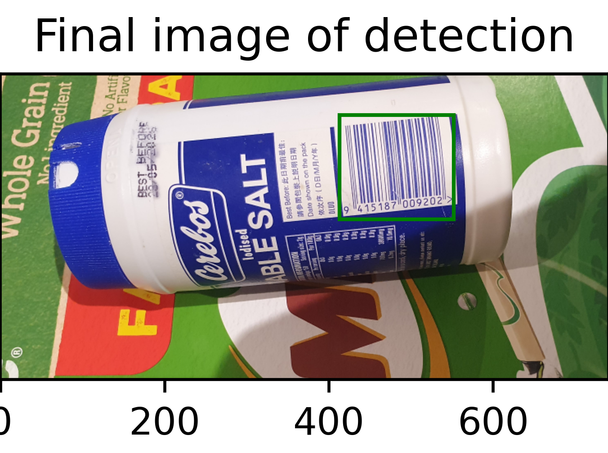

# 📦 Barcode Detector Customiser GUI

A flexible, real-time barcode detection and visualisation tool built in Python. This project includes two implementations:  
- A **non-GUI version**, created using only Python’s built-in libraries for maximum portability.  
- A **GUI-based version**, extended with external libraries like OpenCV and PySimpleGUI, offering live camera detection and parameter customisation.


## 🚀 Features

- 🔍 Adjustable barcode detection pipeline  
- 🎛️ GUI for real-time parameter tuning  
- 📷 Live webcam detection mode (experimental)  
- ⚙️ Step-wise filter control: grayscale → edge detection → Gaussian blur → thresholding → erosion/dilation → connected component analysis  
- 🖼️ Dual image view (processed + original)  


## 🧱 Project Structure
```
.
├── /images                    — Sample images for testing  
├── /output_images             — Output directory for processed images  
├── CS373_barcode_detection.py — Non-GUI application  
├── extension.py               — GUI application  
```


## 🔧 Installation

### Required Packages (for GUI version)
```
pip install pysimplegui opencv-python numpy pyzbar
```
On Linux: run  
```
sudo apt install libzbar0
```
to enable barcode reading via pyzbar.


## ▶️ Usage

### Run non-GUI Version
```
python CS373_barcode_detection.py [image name]
```
- Only supports PNG images
- Image name is the file name of the image in the images folder. (eg. Barcode1 for ./images/Barcode1.png)

### Run GUI Version
```
python extension.py
```
1. Browse to a folder with barcode images  
2. Select an image and enable processing steps via checkboxes  
3. Adjust parameters for each filter in real time  
4. Use “Show Original Image” to overlay boxes on the input  
5. Toggle “Live Cam” for webcam testing (if available)


## 🧠 Technical Notes

- **Non-GUI version** uses only built-in Python libraries to meet strict assignment constraints  
- **GUI version** removes those restrictions to support live detection and extended functionality  
- OpenCV was found to provide the most efficient real-time performance  
- Barcode reading is handled by `pyzbar`, though performance varies by image clarity


## 📸 Screenshots

| GUI Interface              | Detection Output           |
|---------------------------|----------------------------|
|  |   |

## 🛠️ Future Work

- Improve stability of the live cam feature  
- Evaluate OpenCV's barcode module as an alternative to pyzbar  
- Create lightweight `.exe` builds using minimal OpenCV modules  

